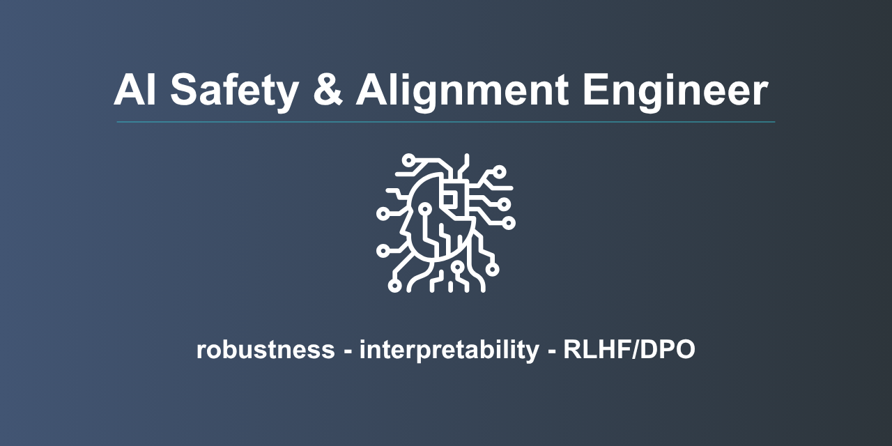

# Hello, I am Christopher L.

I use high-performance computing (HPC) and machine learning to build robust, trustworthy AI systems. My work focuses on AI safety, paraphrase generation, evaluation metrics, and large-scale data analytics.

## Research Interests

- AI safety and security  
- Deep learning and NLP  
- High-performance computing  
